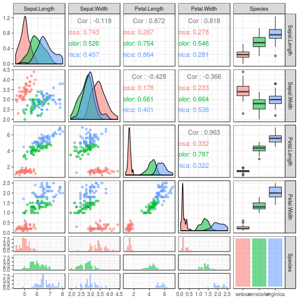
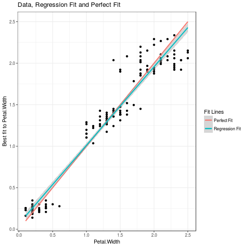
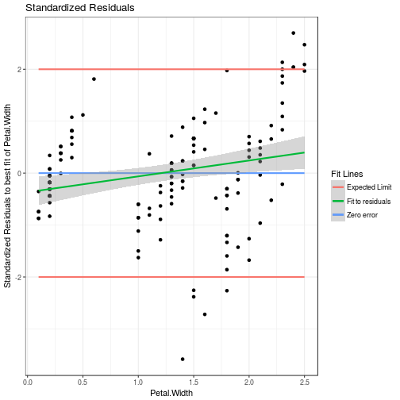

Linear Model Fitting with Shiny
========================================================
author: George Williams
date: 8-May-2017
autosize: true

The Linear Fit Application
========================================================

A Shiny application has been created to allow generating a linear model to fit data within a selected data set.  The applicaton includes three tabs.

The first tab allows selection of the desired data set.  After the data set has been selected, a pairs plot is generated to help one get a feel for how the variables in the selected data set relate to one another.

The second tab allows selection of the variables to be used in the model.  As the selection is made, two plots show how parameter selection affects the model fit.

After one is happy with the fit, the third tab gives the parameters of the model fit.

The Pairs Plot
========================================================
left: 30%
Here is an example of the pairs plot using the iris data set.  Description of the different plot components is included in the application.

***

The Best Fit and Residuals Plots
========================================================

The best fit plot compares the model fit to an ideal fit, and changes as different explanatory variables are chosen.

***

The residuals plot allows one to see if the errors appear to be random, and not excessively large.

Summary and Future Work
========================================================

This tool allows one to easily get a feel for how the variables in a data set relate to one another, and quickly create a model to quantify that relationship.

Possible future improvements to the tool include:

- Allow the user to upload a custom data frame for analysis
- Allow the user to select outliers to be ignored
- Allow finer control over terms to be included in the model
- Include functionality to optimise the model parameter selection process using AIC or BIC estimates
